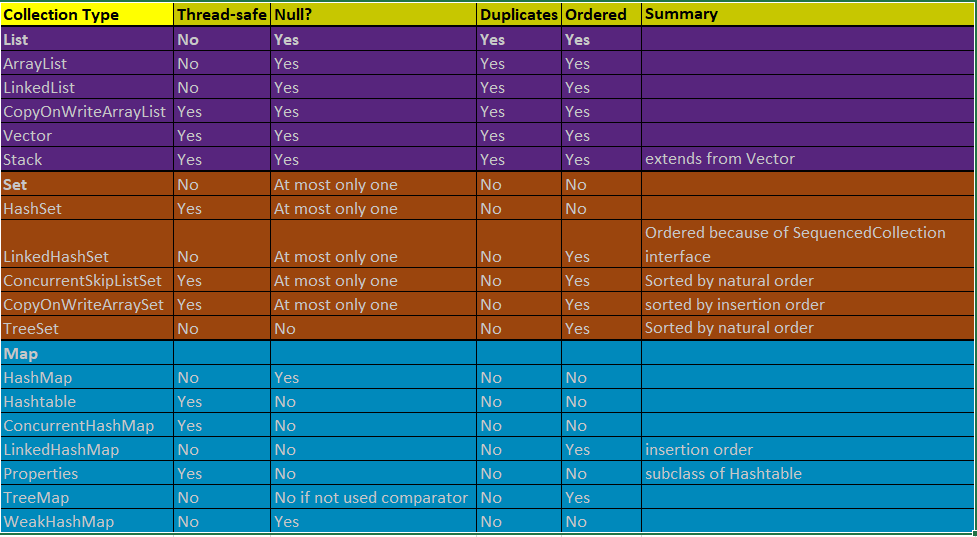

## **Table Of Contents**
* Overview
* Collections Summary (Cheatsheet)
* Collection<E>
  * List<E>
  * Set<E>
    * SortedSet<E>
  * Queue<E>
    * Deque<E>
* Map<K, V>
  * SortedMap<K, V>
* Iterables

## **Java Collections - Overview**

A **Collection** is a container - is an object that groups multiple elements/objects into a single unit. It is used to store, retrieve, modify and aggregate data.

A **Collection Framework is a unified architecture** for representing and manipulating collections. It contains interfaces (abstract types), concrete implementations, algorithms (such as searching and sorting).

The following core collection interfaces are foundation to the framework.

**Iterable** - Root interface for enhanced for-each.

**Map** - Root interface for all key-value pair and **it is not a true collection**. **SortedMap** extends from Map.

**Collection** - It extends from **Iterable** and root interface for all collections such as **List, Set, Queue, Deque**. All core collection interfaces are ***generic types***.

## **Collections Cheatsheet - Summary**

## **Collection**

* The root interface for all collections such as ***List, Set, Queue and Deque***.
* It extends from ***Iterable***.
* All core collection interfaces are ***generic types***.
* We can **traverse all types of collections in 3 ways**:
  * By using **aggregate operations** - Aggregate operations does not change the original collection.
  * By using **enhanced for-each**
  * By using **Iterators** - Refer to Iterables section below.
* **Bulk Operations**: they perform an operation on an entire collection. they changes original collection and aggregate operations are not.
  - `containsAll()`
  - `removeAll()`
  - `retainAll()`
  - `addAll()`
  - `clear()`

## **List**

* It is an **ordered** collection (sometimes called **sequence**). **Ordered** means that each element is associated with an index, hence when we try to add/remove/modify an element using that specific index, same value is guaranteed. Lists always add the elements at the end of the list. Most common data structure is used to implement list is ArrayList.
* Allows **duplicates**.
* Allows more than **one NULL values**.

## **Set**

* It is **NOT an ordered** collection. Set does not maintain an order as it does not expose any index (compared to List). Hence when we iterate/add/remove/modify an element there is no gaurantee that same element is operated. Most commonly used Set is HashSet and Internally it maintains a HashMap (It again maintains an array internally). When that array is full, it will be rehashed to bigger array, During this process all the key/value pairs of HashMap will be rehashed and thats why it changes the encounter order. But LinkedHashSet can give the encounter order.
* Does **NOT allow duplicates**.
* It models the mathematical set abstraction.
* Allows at most **one NULL value only**.
* HashSet is fastest and LinkedHashSet is faster and TreeSet is slow performant compared to other two.

## **SortedSet**

* It is extended from Set.
* It is an **Ordered** collection unlike standard Set mentioned above.
* It maintain elements in **ascending order**.
* Does **NOT allow duplicates**.
* TreeSet is the implementation class.

## **Queue**

* It is **ordered** collection in FIFO manner.
* It order elements in **FIFO (First-In and First-Out)** manner except the elements natural order or Priority Queues.
* Along with standard collection interface methods, it provides additional insertion, removal, retrieval/inspection operations.
* **head** - Removes an element via `remove()` and `poll()` methods.
* **tail** - Insert new elements at the tail of the queue via `offer()` and `add()` methods.
* **Get/Offer** - retrieve/get an element via `element()` and `peek()` methods.

## **Deque (Double ended Queue)**

* It is an **ordered** collection in both FIFO and LIFO manner.
* It can be used **both as FIFO (First-In and First-Out)** and **LIFO (Last-In and First-Out)**.
* Along with standard collection interface methods, it provides additional insertion, removal, retrieval/inspection operations.
* All new elements **can be inserted, removed, retrieved from both ends**.

## **Map**

* It maps keys to values.
* It is **not ordered**.
* It does **NOT allow duplicate keys** because keys should be unique.
* HashMap is fastest and LinkedHashMap is faster and TreeMap is slow performant compared to other two.

## **SortedMap**

* It is extended from Map.
* It is **ordered for keys unlike standard Map mentioned above**.
* It does **NOT allow duplicate keys**.
* TreeMap is implementation class.

## **Collection Iterables**

An **Iterator is an object** that enables you to traverse through a collection and to remove elements from the collection selectively, if desired. The Collection<E> derived from Iterable<E>. 

Use the iterators:
  - when we want to remove an current element as for-each construct hides the iterator (so, you cannot call `remove()`).
  - Iterate over multiple collections in parallel.
  - There are 3 different Iterators that Java provides: 
    * Iterator (standard) - traverse the collection in forward direction.
    * ListIterator (derived from Iterator) - traverse the list (only list) in both directions.
    * Spliterator

### **Iterator**

* We can traverse the collection in forward direction.
* We can remove an element from the collection.
* we can traverse multiple collections in parallel by obtaining multiple collection iterators using a while loop.

### **ListIterator**

* It is derived from Iterator. Hence all the above are applicable.
* We can traverse the List type objects (Only List and no other collection) in both directions because of cursor position.
* We can obtain iterator at any point.
* We can add a new value at any point.
* Set (Modify) a new value at that point.

 ### **Spliterator**

 * ***Spliterator is split (partitions the data) + iterator***.
 * Besides traversing sequences of data like Iterator, Spliterator can also partitions it. 
 * It is core component of Stream API as all the stream implementations uses th spliterator internally.
 * **The core advantage of Spliterator is by splitting data into sub sequences and it allows parallel processing.** However not every data sequence can be split into multiple parts. 
 * **Another advantage is that Spliterator<T> can be used for iterating both the Java Collection Framework types and is the core of Stream API.**
 * The benefit of `Spliterator.tryAdvance()` is that it combines the `hasNext()` and `next()` operations into one method.
 
 ### **Sequenced Collections**

 - Sequenced collections are modelling a common behavior shared by **ordered collections** and **sorted collections**. 
 - It offers **defined encounter order**.  The encounter order does not imply the physical positioning of elements. It just means that one element is either before (closer to the first element) or after (closer to the last element) the other element. The order will have well defined first element, the second element and so forth upto the last element.
 - `List` and `Deque` both define an encounter order, but their common supertype, `Collection` does not. Similarly, `Set` does not define an encounter order, but some subtypes such as `SortedSet` and `LinkedHashSet` do. Support for encounter order is thus spread across the type hierarchy, and operations related to encounter order are either inconsistent or missing. Thats why SequencedCollection brings that uniformity for defined encountered order.
 - It has `addFirst(), addLast(), getFirst(), getLast(), removeFirst(), removeLast(), reversed()` methods for Collection implementations (For Map there are different methods).
 - `SequencedCollection` derived from `Collection`. 

